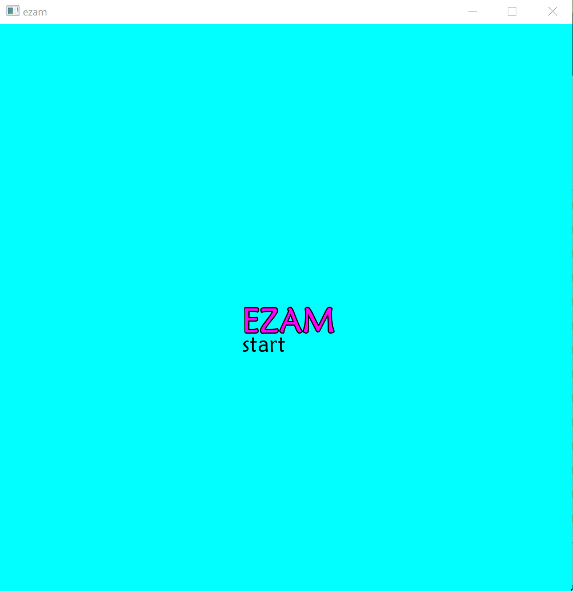

# ezam
This is a maze generator which uses SFML 2.5.1 multi-media interface for displaying result.
It is running only under Windows.
Algorithms used for generation:
* Deep first search
* Krusk
* Recursive division

# Demo 

